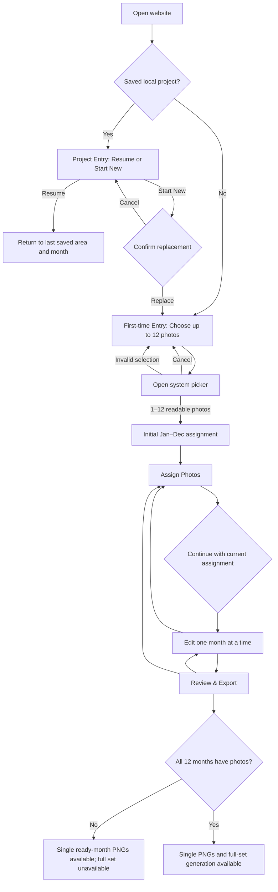

# Calendar Design Studio — V1 User Flow

**Stage:** Session 02 — IA / UX  
**Status:** Approved / Complete  
**Gate:** IA / UX Gate passed with Product Owner approval on 2026-09-22  
**Next authorized stage:** Session 03 — Wireframe, in a new Codex session  
**Scope:** V1 only

## 1. Flow Conventions

- A **ready month** has one readable assigned photo. Default centered fill and white background are valid.
- A **missing month** has no assigned photo.
- Project changes autosave locally in the current browser.
- Month Assignment is called **Assign Photos** in navigation and may be reopened at any time.
- The flows specify user-visible behavior, not technical implementation.
- Capitalized or bold operation names identify semantics for this specification; they do not prescribe final button copy or require every action to appear together.

## 2. End-to-End Flow Map

## 3. First-Time User Happy Path

### Entry and photo selection

1. The first-time user opens the website and sees one combined first-time entry state.
2. It contains a concise explanation of the task, the fixed 2027 context, and a note that work is saved only in this browser on this device.
3. The same state explains:
   - Select up to 12 photos.
   - The initial month order follows the order returned by the picker.
   - The order can be changed next.
   - Fewer than 12 photos are allowed.
4. The user activates the primary photo-selection action and the system picker opens directly; there is no separate Start step.
5. The user selects 12 photos.
6. If all 12 are readable, the system creates the initial assignment: first returned photo to January, continuing through December.
7. The user enters Assign Photos and sees all 12 named month slots.

### Assignment and editing

8. The user reviews the initial order. Actions appear according to whether the selected object is an empty month, occupied month, or Unassigned Photo; the user is not shown the full assignment vocabulary at once.
9. The user continues to editing.
10. The Month Editor opens to January.
11. January is already Ready using centered fill and a white background.
12. The user drags the photo to reposition it, changes zoom, and optionally selects a background color.
13. The user moves to the next month and repeats as desired through December. Skipping customization does not make a month incomplete.
14. At any time, the user can choose a month directly from the month navigator.

### Review and export

15. The user enters Review & Export.
16. The screen shows 12 previews marked Ready and no missing months.
17. The user may open a month for further editing or return to Assign Photos.
18. The user starts full-set export: generate 12 separate January–December PNGs, then use the supported delivery method. Desktop ZIP is a validated candidate; mobile handoff remains open.
19. A transient export progress/result surface appears without discarding or locking the project.
20. On success, the browser’s supported download/save handoff is presented and the project remains editable.

## 4. Fewer-Than-12-Photo Path

1. The user selects between 1 and 11 photos.
2. The selected photos are assigned from January onward in picker-returned order; remaining month slots are Missing Photo.
3. Assign Photos shows the exact count, for example “8 of 12 months have photos.”
4. The user may:
   - Assign or rearrange the available photos.
   - Choose **Add Photos** to select more photos.
   - Continue to editing without filling all months.
5. If the user continues, the editor opens to the first month with a photo. If no month has a photo, it opens January’s empty state.
6. Missing months remain visible in the month navigator and Review & Export.
7. Selecting a missing month opens an empty editor with **Add Photo** as the primary action.
8. Ready months can be edited and downloaded individually.
9. Full-set generation remains unavailable. Review & Export explains how many months are missing and links directly to them.
10. Adding a photo later uses the individual picker and makes that month Ready with centered fill and its existing month background.

## 5. Picker Outcomes

### Picker cancelled

1. The user closes the system picker without selecting photos.
2. The user returns to the first-time entry state or originating month without an error modal.
3. Existing project photos and edits remain unchanged.
4. An optional short info message states “No photos were selected.”

### More than 12 selected

1. If the system picker can enforce the limit, selection stops at 12.
2. Otherwise, the application rejects the over-limit selection as a whole and clearly asks the user to choose no more than 12.
3. It does not silently keep an arbitrary subset.
4. The user can reopen the picker and try again.

### Unreadable photo in a bulk selection

1. Readable photos remain available for the proposed assignment.
2. Each unreadable item is identified as clearly as the browser-provided information permits.
3. The unreadable item is not assigned and is not allowed to overwrite an existing month.
4. The user can continue with fewer photos or choose a replacement.

### Low-resolution photo

1. The photo is accepted.
2. Its affected assignment displays a warning that the exported image may look unclear.
3. The warning does not block editing or export.
4. The user may keep or replace the photo.

### Multi-selection unavailable or interrupted

1. The user receives a clear fallback explanation.
2. The project proceeds to Assign Photos or the Month Editor.
3. The user adds photos one month at a time using the individual picker.
4. The rest of the workflow remains unchanged.

## 6. Month Assignment Flows

### Move an assigned photo to an empty month

1. The user opens the source month’s photo actions.
2. The user selects **Move**.
3. The destination chooser lists only empty months.
4. The user selects a destination.
5. The source month becomes Missing Photo.
6. The destination receives the photo with centered fill.
7. Both months retain their own background colors.
8. A brief non-blocking confirmation reports the completed move; no blocking confirmation is required.

### Swap two occupied months

1. The user opens one month’s photo actions and selects **Swap**.
2. The destination chooser lists occupied months other than the source.
3. The user selects the other month.
4. The two photos exchange month slots.
5. Both changed month-photo pairings reset to centered fill.
6. Each month keeps its own background color.
7. A non-blocking result message names the affected months and makes the reset rule visible.

### Remove a photo from a month

1. The user opens the month’s photo actions and selects **Remove from Month**.
2. The photo moves to Unassigned Photos.
3. The month becomes Missing Photo.
4. The month’s background color remains stored with that month.
5. The photo is still part of the current project and can be reassigned.

### Assign an Unassigned Photo to an empty month

1. The user selects an item in Unassigned Photos and chooses **Assign to Month**.
2. The destination chooser identifies empty months.
3. The selected month receives the photo with centered fill.
4. The item leaves Unassigned Photos because it is now assigned.
5. The month keeps its existing background color.

### Replace an occupied month from Unassigned Photos

1. The user selects an Unassigned Photo and then an occupied month.
2. The action is explicitly labeled **Replace**, not Move.
3. Before committing, the UI states that the current month photo will move to Unassigned Photos and the new photo will use centered fill; the month color will stay.
4. The user confirms Replace.
5. The selected Unassigned Photo becomes the month’s assigned photo.
6. The displaced photo enters Unassigned Photos.
7. The month crop, position, and zoom reset; its background color remains.

### Use the same source photo in another month

1. The user opens an assigned photo’s actions and selects **Use in Another Month**.
2. The source month remains unchanged.
3. The user selects an empty target month, or selects an occupied target and explicitly enters the Replace path.
4. The target month receives a new project photo item using the same source photo and centered fill.
5. The target month retains its background color.
6. Later edits to one month’s crop do not alter the other month’s crop.

### Delete an Unassigned Photo

1. The user opens an Unassigned Photo’s actions and selects **Delete Photo**.
2. A confirmation states that the photo will be removed from this calendar project; it does not claim to delete the original from the device.
3. Cancel leaves the project unchanged.
4. Confirm removes the photo from Unassigned Photos and the active project.

## 7. Replace Photo Path

1. From an occupied month in Assign Photos or the Month Editor, the user selects **Replace Photo**.
2. The individual system picker opens.
3. If the picker is cancelled or the new photo is unreadable, the current photo and all current edits remain unchanged.
4. If a readable photo is selected, the replacement is committed.
5. The old assigned photo moves to Unassigned Photos rather than leaving the project.
6. The new photo uses centered fill; crop, position, and zoom from the old photo are not transferred.
7. The month’s existing background color remains.
8. The interface reports the completed replacement and the preserved/reset behavior without forcing an extra confirmation after success.

## 8. Reopen Assignment Path

1. While editing a month or reviewing the calendar, the user selects **Assign Photos**.
2. The system remembers the originating screen and, if applicable, the current month.
3. Assign Photos shows a persistent short rule: changing a month’s photo resets its crop to centered fill; that month’s background color stays.
4. The user performs one or more assignment changes.
5. Every month whose photo changes follows the reset/preservation rule immediately.
6. The user selects **Done**.
7. The user returns to the origin:
   - From a month editor, return to that month if it still has a photo; otherwise return to its Missing Photo state.
   - From Review & Export, return to Review & Export.
8. A non-blocking summary identifies changed months and states that crops were reset and colors kept.
9. If no assignment changed, no reset summary is shown.

## 9. Month Editing and Navigation Flow

### Ready month

1. The editor displays the current month, preview, state, photo controls, background control, unified Calendar text-color control, small project-wide typography and size preset choices, and navigation.
2. Dragging within the crop surface repositions the photo.
3. Desktop uses an explicit zoom control; touch additionally supports pinch-zoom.
4. The crop always fills its fixed area without exposing empty space.
5. Background color changes apply only to the current month. In default Auto text mode, month title, year, weekdays, and dates switch together between contrasting black and white.
6. The user may choose one Custom text color for those four roles. If it has low contrast against the background, show a non-blocking warning while preserving the chosen color.
7. Selected Calendar typography and Small/Standard/Large scale presets update the English Calendar Proof consistently across all 12 months and never change the Simplified Chinese Product UI font.
8. Changes autosave locally. The month remains Ready; whether it has been edited may be retained as internal metadata.

### Missing month

1. The preview preserves the fixed calendar structure but clearly shows that a photo is missing.
2. **Add Photo** is primary.
3. Previous Month, Next Month, month switcher, Assign Photos, and Review remain available.
4. Single-month download is unavailable with a direct explanation.

### Navigate between months

1. The user selects Previous, Next, or a named month in the navigator.
2. Current changes are locally saved without a separate Save step.
3. The selected month opens with its saved photo, crop, zoom, and background state.
4. On phone, crop gestures never trigger month navigation.

## 10. Review Flow

1. The user opens Review & Export from the editor or project navigation.
2. All 12 months appear in January–December order with a thumbnail or Missing Photo state.
3. Every month with a readable photo is marked Ready. Edited metadata, if later surfaced lightly, does not alter completion.
4. Selecting a month opens it in the Month Editor.
5. Assign Photos remains available for reorganization.
6. If months are missing, the screen displays the count and direct routes to each missing month.
7. Single PNG actions appear only for ready months.
8. Full-set status is always visible: available when 12 of 12 are ready, otherwise unavailable with the reason. The eventual delivery method is shown accurately for the platform.

## 11. Single PNG Export Path

1. From a ready Month Editor or a ready month in Review & Export, the user selects **Download PNG**.
2. A transient export progress/result surface shows that the month image is being prepared; this flow does not require a separate page.
3. Navigation away may require cancelling the in-progress generation, but the project remains saved and editable.
4. On success, the browser’s supported file handoff begins for one 1200 × 1800 px PNG.
5. A success state identifies the month downloaded.
6. On failure, the user sees **Try Again** and can return to editing without losing work.
7. A missing month cannot start this flow; the interface directs the user to Add Photo.

## 12. Full-Set Export Path

### Complete project

1. Review & Export confirms “12 of 12 months ready.”
2. The user selects **Generate Full Set / 生成整套 12 张** (or equivalent localized action).
3. A transient export progress/result surface shows batch progress in terms of the 12 independent PNGs being prepared.
4. The user can remain on the progress state; the underlying project is not changed.
5. On desktop, a validated candidate packages the 12 PNGs in `01`–`12` order into one downloadable ZIP. On mobile, the handoff remains an **OPEN TECHNICAL QUESTION** pending real HTTPS device testing of multi-file Share/Save; ZIP or individual saves are fallback candidates. No automatic sequence of 12 browser downloads.
6. The user returns to Review & Export and may continue editing or retry a download.

### Incomplete project

1. Review & Export reports the number and identity of missing months.
2. The full-set action is unavailable and explains “Add photos to all 12 months to generate the full set.”
3. The user can open a missing month or Assign Photos directly.
4. Ready months remain individually downloadable.

### ZIP failure

1. The progress state changes to a clear export error.
2. The project remains intact.
3. The user can select **Try Again**, return to Review, or download ready months individually.

## 13. Resume Local Project Path

1. The user closes the page or browser after local autosave.
2. Later, the user opens the site in the same browser on the same device.
3. Project Entry detects one saved project and shows:
   - 2027 Calendar.
   - Ready-month count.
   - Last saved information when available.
   - A local-only storage note.
4. **Resume Calendar** is primary.
5. Resume opens the last saved project area and month when that context is still valid.
6. If the transient context cannot be restored, the user enters Review & Export rather than losing access to the project.
7. **Start New Calendar** remains secondary and requires replacement confirmation.

## 14. Start New Project Path

1. The user selects **Start New Calendar** while a project exists.
2. A confirmation clearly states that V1 stores only one project and the existing calendar will be removed from this browser.
3. **Keep Current Calendar** is the safe action.
4. **Replace and Start New** is explicit and destructive.
5. Cancel or Keep returns to the current context unchanged.
6. Confirm opens the fresh first-time entry state, where the primary action launches photo selection directly.

## 15. iPhone Full Workflow

1. In Safari portrait, a first-time user sees the combined entry/photo-selection state; a returning user sees Resume or Start New.
2. The first-time primary action opens the iOS system photo picker for up to 12 photos directly.
3. After selection, Assign Photos presents named month slots in a touch-friendly sequence.
4. The user taps an empty month, occupied month, or Unassigned Photo to see only the actions valid for that context; assignment never requires dragging.
5. Destination selection uses a named month list showing Empty or Occupied status.
6. The user continues to the Month Editor.
7. The preview occupies the main usable area. Drag repositions the photo and pinch changes zoom.
8. Previous/Next and the explicit month switcher sit outside the crop surface; horizontal crop movement never changes months.
9. Background and Calendar text controls open in compact sheets or panels that respect Safari safe areas and browser chrome; the font preset is reachable on phone without reducing the preview to a thumbnail.
10. Autosave preserves completed changes when Safari is interrupted or backgrounded, subject to the documented local-storage limitation.
11. Review & Export displays a single-column or compact two-column month overview, depending on available width.
12. The user downloads a ready month or, when complete, generates the 12 monthly PNGs and uses the validated Safari handoff. Multi-file Share/Save versus ZIP or individual-save fallback remains open until trusted-HTTPS testing.
13. Export progress and failure recovery remain visible without requiring a desktop.

If iOS multi-selection is unavailable or interrupted, the same full flow remains possible by adding one photo per month.

## 16. Error and Recovery Flows

| Condition | Severity | User-visible response | Recovery |
|---|---|---|---|
| Picker cancelled | Info | Return to origin; optional “No photos selected” message | Reopen picker or continue existing work |
| More than 12 selected | Warning | Reject whole over-limit selection or enforce limit; never silently trim | Choose up to 12 |
| Unreadable new image | Error | Identify failure; preserve existing assignment and edits | Select another image |
| Low-resolution image | Warning | Mark affected photo; allow use | Keep or replace |
| Missing months | Info | Show month names/count; full set unavailable | Add photos now or later |
| Single PNG unavailable | Info | Explain that the month needs a photo | Add Photo |
| Export failed | Error | Preserve project and show failure | Try Again or return to editing |
| ZIP failed | Error | Preserve project; individual downloads remain available | Try Again or download individually |
| Local save failed | Error | Persistent message that recent changes may not be saved; never claim success | Reduce project load if instructed, retry, or keep page open while resolving |
| Another tab has newer state | Warning | Block stale writes and ask user to refresh | Refresh to load newer saved state |
| Mobile workflow interrupted | Info/Error according to loss | Resume last saved context; explain only if transient work was not saved | Continue from restored project |
| New project replaces current work | Destructive warning | Explicit confirmation naming the one-project limit | Keep current or replace and start new |

## 17. Exit and Back Behavior

- Visible in-product navigation is always provided; users are not required to depend on browser Back.
- Browser Back returns to the previous product area when feasible and must not silently create or delete a project.
- Leaving a picker, action sheet, color control, or confirmation returns to the unchanged originating state.
- Because normal changes autosave, navigating among project areas does not require a Save confirmation.
- If saving has failed, leaving the site requires a clear warning that recent changes may not be stored, subject to browser capabilities.

## 18. Remaining Handoffs

No unresolved UX question blocks these flows. Technical Validation still needs to verify picker behavior, image decoding, local capacity, and mobile download handoff. Session 03 must translate these flows into wireframes without changing their semantics or expanding V1 scope.
