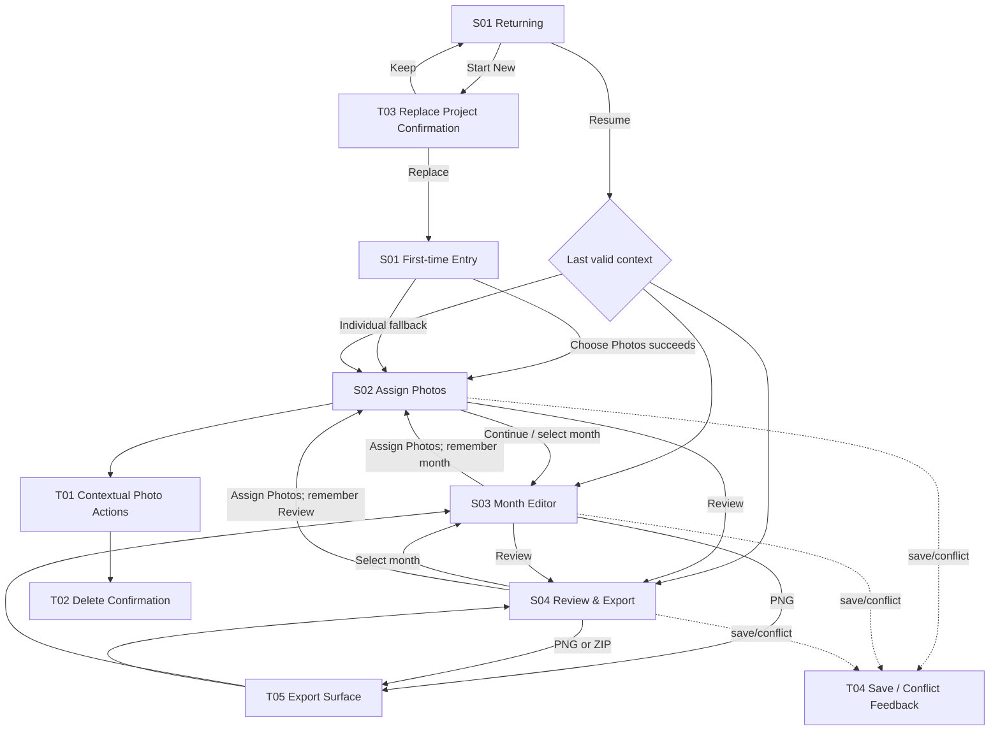

# Calendar Design Studio — V1 Low-Fidelity Wireframes

**Stage:** Session 03 — Wireframe  
**Status:** Approved / Complete  
**Wireframe Gate:** Passed with Product Owner approval on 2026-09-23  
**Next authorized stage:** Session 04 — High-Fidelity UI Prototype, in a new Codex session  
**Scope:** V1 only  
**Decision record:** `design/wireframe-decisions.md`

## 1. Purpose and Reading Guide

This artifact translates the approved product and IA/UX specifications into low-fidelity page structure. It defines where users see information, where they act, how transient surfaces are arranged, and how the same workflow rearranges across desktop and mobile.

These diagrams are deliberately grayscale and structural. They are not a visual-design specification and do not select exact sizes, breakpoints, colors, typography, icons, shadows, motion, or implementation libraries.

**Controlled V1 change (Session 04):** Product UI labels, controls, status, dialogs, sheets, and feedback render in Simplified Chinese. The Calendar Proof and exported Calendar Output remain English (`January`–`December`, `2027`, `S M T W T F S`, Arabic dates). English UI labels in the original grayscale diagrams below denote approved structural roles, not final interface copy.

### 1.1 Diagram legend

```text
[ Primary action ]      button or large tap/click target
[ Secondary ]           secondary action
[ disabled: reason ]    visible but unavailable action
< field / slider >      interactive control
...                     repeated content
PHOTO / PREVIEW         grayscale image placeholder
Missing Photo / Ready   the only user-facing month completion states
---- sticky ----        remains reachable while its screen region scrolls
---- sheet ----         transient surface above the current screen
```

### 1.2 Wireframe principles

1. **Mobile first, not mobile only.** Phone portrait and desktop each receive a complete, purpose-built layout. Phone users can choose, assign, edit, review, and export without a computer.
2. **Preview is the hero.** The monthly calendar preview receives the dominant editor area. Photo/crop, arbitrary solid background, one unified Calendar Text Color, and a small Calendar Font preset choice remain compact secondary controls.
3. **Low cognitive load.** The UI does not imitate a professional design suite. It exposes only the action needed in the current context.
4. **Tap/click completeness.** Assignment never depends on drag, hover, right-click, long-press, or precision drop. Touch gestures inside the crop are reserved for photo repositioning and zoom.
5. **Stable calendar context.** The fixed year, current month, month state, and January–December order remain clear. The limited Calendar Font presets do not imply that year, template, week start, or layout are editable.
6. **Defaults are valid.** A readable photo makes a month Ready. The wireframe never treats an unchanged centered crop or white background as unfinished.
7. **Quiet success, visible risk.** Normal autosave is quiet. Save failure persists. A newer-tab conflict blocks stale editing.
8. **Safe transient UI.** Mobile sheets and sticky regions reserve safe-area space and tolerate changing Safari/Chrome browser chrome.

## 2. Shared Project Shell

The shell is intentionally light. It identifies the one 2027 project and supplies routes among the three established project areas without creating a project dashboard.

### 2.1 Desktop shell

```text
+----------------------------------------------------------------------------------+
| Calendar Design Studio   2027 Calendar       Saved on this device       [menu]  |
|                                                                                  |
|  Assign Photos             Edit Months              Review & Export              |
|  (current destination is visibly selected)                                      |
+----------------------------------------------------------------------------------+
| Optional persistent save-error banner; absent while saves are healthy            |
+----------------------------------------------------------------------------------+
| SCREEN CONTENT                                                                   |
+----------------------------------------------------------------------------------+
```

`[menu]` contains low-frequency project information and **Start New Calendar**. It does not contain editing tools.

### 2.2 Phone shell

```text
+----------------------------------+
| Calendar Design Studio      [menu]|
| 2027 Calendar                    |
| Current: Edit Months             |
+----------------------------------+
| Optional save-error banner       |
+----------------------------------+
| SCREEN CONTENT                   |
+----------------------------------+
```

The compact menu names all three destinations—Assign Photos, Edit Months, Review & Export—and Start New Calendar. The current destination is also written in the shell so orientation does not depend on an icon.

When screen-specific sticky controls exist, they sit below the browser-visible top edge and do not cover the save-error banner.

## 3. S01 — Project Entry

S01 has two mutually exclusive states. It is neither a marketing site nor a project dashboard.

### 3.1 First-time / no saved project — Desktop

```text
+----------------------------------------------------------------------------------+
| Calendar Design Studio                                                          |
+----------------------------------------------------------------------------------+
|                                                                                  |
|                 Make a personal 2027 photo calendar                              |
|                 Turn up to 12 photos into one month-by-month set.                |
|                                                                                  |
|                 +----------------------------------------------+                 |
|                 |  2027 STANDARD PHOTO CALENDAR               |                 |
|                 |                                              |                 |
|                 |  Choose up to 12 photos.                     |                 |
|                 |  Fewer than 12 is okay—you can add more.     |                 |
|                 |  Photos start in the order returned by       |                 |
|                 |  your picker; you can rearrange them next.   |                 |
|                 |                                              |                 |
|                 |        [ Choose Photos ]                     |                 |
|                 |                                              |                 |
|                 |  Add one month at a time instead             |                 |
|                 +----------------------------------------------+                 |
|                                                                                  |
|                 Saved only in this browser on this device. No cloud backup.      |
|                                                                                  |
+----------------------------------------------------------------------------------+
```

Behavior notes:

- **Choose Photos** opens the external system picker directly.
- “Add one month at a time instead” is a secondary fallback; it enters S02 with twelve empty slots.
- Picker cancellation returns to this exact state. Optional text such as “No photos were selected” appears inline, not in a modal.
- Over-limit or unreadable-selection feedback appears between the guidance and primary action without clearing prior valid state.

### 3.2 First-time / no saved project — Phone portrait

The product promise, 2027 context, selection rule, and primary action fit in the initial usable viewport on an ordinary phone portrait screen.

```text
+----------------------------------+
| Calendar Design Studio           |
+----------------------------------+
|                                  |
| Make a personal 2027             |
| photo calendar                   |
|                                  |
| One consistent calendar set      |
| made from your photos.            |
|                                  |
| 2027 · 12 monthly images         |
|                                  |
| Choose up to 12 photos. Fewer is |
| okay. You can change their month |
| order on the next screen.        |
|                                  |
| [      Choose Photos      ]      |  primary, above first-view fold
|                                  |
| Add one month at a time instead  |
|                                  |
| Saved only in this browser on    |
| this device. No cloud backup.    |
+----------------------------------+
```

### 3.3 Returning / saved project — Desktop

```text
+----------------------------------------------------------------------------------+
| Calendar Design Studio                                                          |
+----------------------------------------------------------------------------------+
|                                                                                  |
|                 Welcome back                                                     |
|                 +----------------------------------------------+                 |
|                 |  2027 CALENDAR                              |                 |
|                 |  9 / 12 months ready                        |                 |
|                 |  Missing: April, August, November            |                 |
|                 |  Last saved: Today, 14:32                    |                 |
|                 |                                              |                 |
|                 |       [ Resume Calendar ]                    |                 |
|                 |       Start New Calendar                     |                 |
|                 +----------------------------------------------+                 |
|                 Saved only in this browser on this device.                       |
|                 Clearing browser data may remove this calendar.                  |
|                                                                                  |
+----------------------------------------------------------------------------------+
```

**Resume Calendar** is the only primary action. **Start New Calendar** opens T03 and never replaces the project immediately.

### 3.4 Returning / saved project — Phone portrait

```text
+----------------------------------+
| Calendar Design Studio           |
+----------------------------------+
| Welcome back                     |
|                                  |
| +------------------------------+ |
| | 2027 CALENDAR                | |
| | 9 / 12 months ready          | |
| | Missing: APR · AUG · NOV     | |
| | Last saved: Today, 14:32     | |
| +------------------------------+ |
|                                  |
| [      Resume Calendar      ]    |
|                                  |
| Start New Calendar               |
|                                  |
| Saved only in this browser on    |
| this device. No cloud backup.    |
+----------------------------------+
```

## 4. S02 — Assign Photos

The recommended desktop layout is a 4 × 3 grid. The recommended phone layout is a 2-column compact grid. Both use row-major January–December order and open T01 from the entire month card.

### 4.1 Desktop — partial assignment

```text
+----------------------------------------------------------------------------------+
| PROJECT SHELL: Assign Photos selected                                             |
+----------------------------------------------------------------------------------+
| Assign Photos                                      8 / 12 months ready            |
| Check the month order. Changing a month photo centers its crop;                  |
| that month's background color stays.                         [ Add Photos ]       |
+----------------------------------------------------------------------------------+
| +---------------+ +---------------+ +---------------+ +---------------+          |
| | JANUARY Ready | | FEBRUARY Ready| | MARCH Missing | | APRIL Ready   |          |
| |               | |               | |               | |               |          |
| |   PHOTO 01    | |   PHOTO 02    | |  + Add Photo  | |   PHOTO 04    |          |
| |               | |               | |               | |               |          |
| | Actions ...   | | Actions ...   | | Fill month >  | | Actions ...   |          |
| +---------------+ +---------------+ +---------------+ +---------------+          |
| +---------------+ +---------------+ +---------------+ +---------------+          |
| | MAY Ready     | | JUNE Ready    | | JULY Ready    | | AUGUST Missing|          |
| |   PHOTO 05    | |   PHOTO 06    | |   PHOTO 07    | |  + Add Photo  |          |
| | Actions ...   | | Actions ...   | | Actions ...   | | Fill month >  |          |
| +---------------+ +---------------+ +---------------+ +---------------+          |
| +---------------+ +---------------+ +---------------+ +---------------+          |
| | SEPT Ready    | | OCT Ready     | | NOV Missing   | | DEC Missing   |          |
| |   PHOTO 09    | |   PHOTO 10    | |  + Add Photo  | |  + Add Photo  |          |
| | Actions ...   | | Actions ...   | | Fill month >  | | Fill month >  |          |
| +---------------+ +---------------+ +---------------+ +---------------+          |
|                                                                                  |
| UNASSIGNED PHOTOS · 2                        selected for this calendar only       |
| +---------------+ +---------------+                                              |
| |   PHOTO A     | |   PHOTO B     |     Each card opens Assign / Delete actions. |
| | Actions ...   | | Actions ...   |                                              |
| +---------------+ +---------------+                                              |
+----------------------------------------------------------------------------------+
| [ Review & Export ]                           [ Continue to Edit Months ]          |
+----------------------------------------------------------------------------------+
```

Structural notes:

- The rule about crop reset and background preservation stays visible near the screen heading.
- Cards show only month, Ready/Missing Photo, image/placeholder, warning marker when relevant, and one contextual affordance.
- **Add Photos** is present while more project photos are useful. It does not silently allow an over-limit bulk result.
- The footer action row is sticky only when the viewport would otherwise put Continue/Done far below the content. It must not cover the Unassigned Photos cards.
- On initial use, the primary footer label is **Continue to Edit Months**. When reopened, it is **Done** and returns to the recorded origin.

### 4.2 Phone portrait — partial assignment, recommended

```text
+----------------------------------+
| PROJECT SHELL                    |
+----------------------------------+
| Assign Photos                    |
| 8 / 12 months ready             |
|                                  |
| Changing a photo centers its     |
| crop. Month color stays.         |
| [ Add Photos ]                   |
+----------------------------------+
| +--------------+ +--------------+|
| | JAN · Ready  | | FEB · Ready  ||
| |   PHOTO 01   | |   PHOTO 02   ||
| |         ...  | |         ...  ||
| +--------------+ +--------------+|
| +--------------+ +--------------+|
| | MAR · Missing| | APR · Ready  ||
| |  + Add Photo | |   PHOTO 04   ||
| |          >   | |         ...  ||
| +--------------+ +--------------+|
| +--------------+ +--------------+|
| | MAY · Ready  | | JUN · Ready  ||
| |   PHOTO 05   | |   PHOTO 06   ||
| +--------------+ +--------------+|
| | ... JUL–DEC in row order ...  ||
| +--------------+ +--------------+|
|                                  |
| Unassigned Photos · 2            |
| Selected for this calendar only  |
| +--------------+ +--------------+|
| |   PHOTO A    | |   PHOTO B    ||
| |         ...  | |         ...  ||
| +--------------+ +--------------+|
+----------------------------------+
| Review       [ Continue / Done ] | sticky above safe area
+----------------------------------+
```

The card body is the tap target. The ellipsis represents a labeled actions affordance, not a hover menu. At widths or text sizes where labels or touch targets no longer fit, the same cards rearrange to one column; semantics do not change.

### 4.3 Empty state — all months Missing Photo

```text
+-----------------------------------------------+
| Assign Photos                 0 / 12 ready    |
| Add photos now or fill each month later.      |
|                     [ Add Photos ]             |
+-----------------------------------------------+
| JAN Missing | FEB Missing | ... | DEC Missing |
| [ + Add ]   | [ + Add ]   |     | [ + Add ]   |
+-----------------------------------------------+
| Unassigned Photos section is absent.          |
+-----------------------------------------------+
| [ Review ]                  [ Continue ]       |
+-----------------------------------------------+
```

Continue remains available for the individual-picker fallback and opens January’s Missing Photo editor. It is not presented as the preferred recovery action; Add Photos is primary.

### 4.4 Partial state

- Ready count and Missing Photo labels are both shown; neither relies on color alone.
- Add Photos remains visible.
- Continue/Done remains available.
- Unassigned Photos appears only if non-empty.
- A low-resolution warning is attached to the specific card and leads to keep/replace information without changing Ready status.

### 4.5 Full state — all months Ready

```text
+----------------------------------------------------------------------------------+
| Assign Photos                                      12 / 12 months ready           |
| Check the order. Changing a photo centers its crop; month color stays.            |
+----------------------------------------------------------------------------------+
|                 4 × 3 grid; every card shows PHOTO + Ready                        |
+----------------------------------------------------------------------------------+
| Unassigned Photos appears here only if non-empty.                                 |
+----------------------------------------------------------------------------------+
| [ Review & Export ]                           [ Continue / Done ]                  |
+----------------------------------------------------------------------------------+
```

No success badge implies that crop/color customization is required. If no additional project photo can be meaningfully added, Add Photos is omitted rather than shown as a dead primary action.

### 4.6 Unassigned Photos behavior

- The section follows all twelve month slots and is never placed in a separate library screen.
- Its heading includes the count and the clarification “Selected for this calendar only.”
- An Unassigned card opens only **Assign to Month** and **Delete Photo** entry points.
- Delete always routes through T02.
- If assigning to an occupied month, T01 shows the Replace commitment before changing anything.
- When the last item leaves the section, the section disappears and the surrounding content closes the gap.

## 5. T01 — Contextual Photo Actions / Destination Chooser

Desktop uses an anchored contextual surface followed by a focused destination dialog/panel. Phone uses a bottom sheet, expanding to a near-full-height sheet for the destination list. The content below is identical in meaning.

### 5.1 Empty month selected

```text
---- contextual surface: MARCH · Missing Photo ----
| Fill March                                        |
| [ Choose a New Photo ]                            |
| [ Use an Unassigned Photo ]  shown only if any    |
|                                                  |
| Cancel                                            |
----------------------------------------------------
```

Choosing a new photo opens the system picker. Choosing an Unassigned Photo advances to a thumbnail list, then commits to March with centered fill while March’s stored background stays.

### 5.2 Occupied month selected

```text
---- contextual surface: JANUARY · Ready -----------
| [ Edit January ]                                  |
| [ Replace Photo ]          opens system picker    |
| [ Move to Empty Month ]    only if an empty exists|
| [ Swap with Another Month ] only if occupied peer |
|                                                  |
| More photo options                               |
|   Remove from January                             |
|   Use in Another Month                            |
|                                                  |
| Cancel                                            |
----------------------------------------------------
```

The surface contains only actions valid in the current project state. “Use in Another Month” is visually secondary. “Remove from January” is not labeled Delete because the photo moves to Unassigned Photos.

### 5.3 Unassigned Photo selected

```text
---- contextual surface: Unassigned Photo ----------
| [ Assign to Month ]                               |
| Delete Photo from this calendar...                |
|                                                  |
| Cancel                                            |
----------------------------------------------------
```

Delete routes to T02. The device original is never described as being deleted.

### 5.4 Destination chooser

```text
Desktop dialog / mobile near-full-height sheet
+----------------------------------------------+
| Move photo                              [x]  |
| Choose an empty month.                        |
|                                              |
| JANUARY     Current                            |
| FEBRUARY    Ready                    unavailable|
| MARCH       Missing Photo                [ > ] |
| APRIL       Ready                    unavailable|
| MAY         Missing Photo                [ > ] |
| ...                                          |
| DECEMBER    Missing Photo                [ > ] |
|                                              |
| [ Cancel ]                                   |
+----------------------------------------------+
```

Chooser filtering follows the initiated action:

- Move: empty months only are selectable.
- Swap: occupied months other than the source are selectable.
- Assign an Unassigned Photo: all months are visible; empty targets commit assignment, occupied targets enter Replace commitment.
- Use in Another Month: all other months are visible; the source remains unchanged. Empty targets accept the new use, while occupied targets enter Replace commitment.

### 5.5 Occupied destination — Swap / Replace distinction

An occupied destination never produces a vague “move here” commitment. The surface names whether the result is a Swap or a Replace and describes the different outcome.

Swap confirmation, reached from an occupied month’s **Swap with Another Month** path:

```text
+--------------------------------------------------+
| Swap January and April photos?                   |
|                                                  |
| [January photo]   <---->   [April photo]         |
|                                                  |
| Both photos will start centered in their new     |
| months. January and April keep their own         |
| background colors.                               |
|                                                  |
| [ Cancel ]                         [ Swap Photos ]|
+--------------------------------------------------+
```

Replace commitment, reached when an Unassigned Photo, a newly chosen photo, or **Use in Another Month** targets an occupied month:

```text
+--------------------------------------------------+
| Replace April's photo?                           |
|                                                  |
| [incoming]  will replace  [current April photo]  |
|                                                  |
| The current April photo will move to Unassigned  |
| Photos. The new photo starts centered. April's   |
| background color stays.                          |
|                                                  |
| [ Cancel ]                       [ Replace Photo ]|
+--------------------------------------------------+
```

For a newly chosen replacement, the picker completes before this commitment is shown; cancelling either the picker or this commitment leaves the current photo and edits unchanged. For **Use in Another Month**, the source month stays unchanged. Swap never sends either photo to Unassigned Photos; Replace always moves the displaced destination photo there.

### 5.6 Mobile sheet relationship

```text
+----------------------------------+
| dimmed originating S02/S03       |
|                                  |
|                                  |
+----------------------------------+
| ---- bottom sheet -------------  |
| drag indicator (not required)    |
| Context title                    |
| large, labeled action rows       |
| Cancel                           |
| safe-area padding                |
+----------------------------------+
```

The sheet is dismissed by Cancel or the standard close affordance. No action depends on swiping the sheet.

## 6. S03 — Month Editor

**Session 05 Product Owner clarification:** the portrait 2:3 ratio belongs to the whole 1200 × 1800 proof. The upper Photo Region spans its full width and the image covers that region edge to edge; the lower Calendar Region is separate. The centered 800 × 1200 photo box used by the disposable technical spike is not this wireframe. Pointer/mouse or single-finger drag repositions the covered image, pinch and explicit zoom change scale, and Reset returns to centered fill without gutters or exposed blank area.

### 6.1 Desktop — Ready month, recommended layout

```text
+------------------------------------------------------------------------------------------------+
| PROJECT SHELL: Edit Months selected                                  Saved on this device       |
+------------------------------------------------------------------------------------------------+
| [‹ Previous]   JAN • FEB • MAR • APR • MAY • JUN • JUL • AUG • SEP • OCT • NOV • DEC   [Next ›]|
|                 dots/labels also show Missing or Ready; JAN selected                            |
+------------------------------------------------------------------------------------------------+
| JANUARY 2027 · Ready                                      [ Assign Photos ] [ Review & Export ] |
+---------------------------------------------------------------+--------------------------------+
|                                                               | PHOTO                          |
|                  MONTHLY CALENDAR PREVIEW                     | Drag the photo to reposition.  |
|                                                               |                                |
|                  +-------------------------+                  | Zoom  [---o--------------]      |
|                  |                         |                  | [ Reset Crop ]                 |
|                  |       PHOTO CROP        |                  |                                |
|                  |    drag to reposition   |                  | [ Replace Photo ]              |
|                  |                         |                  | low-resolution warning, if any |
|                  +-------------------------+                  |                                |
|                  | JANUARY 2027            |                  | BACKGROUND                     |
|                  | S  M  T  W  T  F  S     |                  | [ swatch ]  # value/field      |
|                  | six fixed date rows     |                  | One solid color; Auto contrast |
|                  |                         |                  | [ Calendar Text: color + font ]|
|                  +-------------------------+                  |                                |
|                                                               | EXPORT                         |
|             Preview is portrait 2:3 and remains dominant.     | [ Download January PNG ]      |
|                                                               | 1200 × 1800 px                |
+---------------------------------------------------------------+--------------------------------+
```

Desktop relationships:

- The project shell and month navigator remain visible while the editor body scrolls only if vertical space is constrained.
- The preview column receives the remaining width after a bounded, narrow control column.
- The preview may scale down to fit the available height, but it never becomes a tiny thumbnail beside oversized controls.
- Pointer drag is active only in the photo crop region. The explicit zoom control is always present.
- Direct January–December navigation is outside the crop surface.

### 6.2 Desktop — Missing Photo month

```text
+------------------------------------------------------------------------------------------------+
| [‹ Previous]   ... APR selected / Missing Photo ...                                  [Next ›]  |
+------------------------------------------------------------------------------------------------+
| APRIL 2027 · Missing Photo                                 [ Assign Photos ] [ Review & Export ]|
+---------------------------------------------------------------+--------------------------------+
|                  MONTHLY CALENDAR PREVIEW                     | PHOTO                          |
|                  +-------------------------+                  | April needs a photo before it |
|                  |                         |                  | can be downloaded.             |
|                  |      Missing Photo      |                  |                                |
|                  |      [ Add Photo ]      |                  | [ Add Photo ]                  |
|                  |                         |                  |                                |
|                  +-------------------------+                  | BACKGROUND                     |
|                  | APRIL 2027              |                  | [ swatch ] color control      |
|                  | S  M  T  W  T  F  S     |                  | remains editable              |
|                  | six fixed date rows     |                  | [ Calendar Text: color + font ]|
|                  +-------------------------+                  | [ Download PNG — unavailable ]|
+---------------------------------------------------------------+--------------------------------+
```

The page is still the Month Editor, not an error page. Month identity, calendar layout, background color, compact Calendar Text Color/Font controls, all navigation, Assign Photos, and Review remain available.

### 6.3 Phone portrait — Ready month, recommended layout

```text
+----------------------------------+
| PROJECT SHELL              [menu]|
+----------------------------------+
| JANUARY 2027 ▾         [ Review ]| sticky below shell
| Ready                            |
+----------------------------------+
|                                  |
|      MONTHLY PREVIEW             |
|  +----------------------------+  |
|  |                            |  |
|  |        PHOTO CROP          |  |
|  |  drag = move / pinch=zoom  |  |
|  |                            |  |
|  +----------------------------+  |
|  | JANUARY 2027               |  |
|  | S  M  T  W  T  F  S       |  |
|  | six fixed date rows        |  |
|  +----------------------------+  |
|                                  |
| [ Photo & Crop ] [ Background ] |
| [ Calendar Text: color + font ]|
| [ Replace Photo ] [ Download PNG]|
|                                  |
| Saved on this device             |
|                                  | scroll region ends above dock
+----------------------------------+
| ‹ Previous                Next › | sticky above safe area
|          safe-area padding       |
+----------------------------------+
```

Phone relationships:

- The app shell may scroll out on short viewports, but the compact current-month row stays sticky while editing.
- The main region scrolls; the preview is as wide as practical and retains its portrait proportion.
- The top month-and-year control is the only direct month selector. Tapping it opens the January–December month-switcher sheet.
- The bottom month-navigation dock contains only Previous Month and Next Month for sequential navigation. It is sticky rather than part of the crop surface, reserves safe-area padding, and is not hidden behind browser chrome.
- **Photo & Crop**, **Background**, and compact **Calendar Text** settings open task-specific bottom sheets. Replace Photo opens the system picker. Download PNG opens T05.
- On a short screen, the user may scroll the action rows into view, but the top direct selector and bottom sequential navigation remain reachable without duplicating one another.

### 6.4 Direct month switcher — Phone

```text
---- bottom sheet: Choose a month -----------------
| 2027                                   [Close]   |
| +-----------+ +-----------+                     |
| | JAN Ready | | FEB Ready |                     |
| +-----------+ +-----------+                     |
| | MAR Ready | | APR Missing|                    |
| +-----------+ +-----------+                     |
| | ... through DEC ...      |                    |
| +-----------+ +-----------+                     |
| safe-area padding                               |
---------------------------------------------------
```

The switcher uses a compact 2-column list/grid of month names and states. It never requires a horizontal carousel.

### 6.5 Photo & Crop control sheet — Phone

```text
---- bottom sheet: Photo & Crop -------------------
| Drag the photo in the preview to reposition it. |
| Pinch the preview or use Zoom below.             |
|                                                  |
| Zoom  [-------o----------------]                 |
| [ Reset Crop ]                                  |
|                                                  |
| [ Done ]                                        |
| safe-area padding                               |
---------------------------------------------------
```

The explicit zoom control ensures the task does not rely on a multi-touch gesture. The sheet does not introduce rotate, filters, free crop, or aspect-ratio controls.

### 6.6 Background control sheet — Phone

```text
---- bottom sheet: Background ---------------------
| Current solid color                             |
| [ swatch ]  color picker/control                |
|                                                  |
| Auto text color responds to background.         |
| Custom text color is set in Calendar Text.      |
|                                                  |
| [ Done ]                                        |
| safe-area padding                               |
---------------------------------------------------
```

Background retains picker, HEX, RGB, and Quick Colors for any solid color. It does not offer a gradient, texture, background image, or multiple-region control. Text color lives in the separate compact Calendar Text surface below.

### 6.6a Calendar Text — desktop property section / phone sheet

```text
---- compact Calendar Text surface ---------------
| Font [ January ][ January ][ January ]       |
|      classic     minimal     handwritten      |
| Size [ Small ][ Standard ][ Large ]          |
| Text Color  [ Auto ] [ Custom ]                |
| if Custom: [ color picker ] [ HEX ]            |
| low contrast: non-blocking warning            |
|             [ Done on phone ]                 |
--------------------------------------------------
```

On desktop these controls appear directly as a `日历文字` section in the right properties panel, at the same level as Photo, Background, and Export; no dialog is required. On phone the same compact controls remain in a bottom sheet. Both Ready and Missing Photo can reach them. One text color applies to the month title, year, weekdays, and dates; a selected typography preset may internally define different role fonts/weights/spacing, while one project-wide Small/Standard/Large scale applies to English Calendar Output across the set. The Product UI font is independent. This is not a per-element typography panel.

### 6.7 Phone portrait — Missing Photo month

```text
+----------------------------------+
| APRIL 2027 ▾           [ Review ]| sticky
| Missing Photo                    |
+----------------------------------+
|      MONTHLY PREVIEW             |
|  +----------------------------+  |
|  |                            |  |
|  |       Missing Photo        |  |
|  |       [ Add Photo ]        |  |
|  |                            |  |
|  +----------------------------+  |
|  | APRIL 2027                 |  |
|  | S  M  T  W  T  F  S       |  |
|  | six fixed date rows        |  |
|  +----------------------------+  |
|                                  |
| [ Add Photo ]  [ Background ]   |
| [ Calendar Text ]              |
| PNG unavailable: add a photo.   |
| [ Assign Photos ]               |
+----------------------------------+
| ‹ Previous                Next › | sticky + safe area
+----------------------------------+
```

### 6.8 Autosave and assignment-return feedback

- Healthy state: small “Saved on this device” text; no repeating success toast.
- While saving feedback is necessary: “Saving…” may replace that text temporarily.
- After returning from Assign Photos with changes: an inline, dismissible summary appears below the editor heading, for example: “March and April photos changed. Their crops were centered; month colors were kept.”
- If no assignment changed, no summary appears.
- Save failure and conflict use T04.

## 7. S04 — Review & Export

**Session 05 Product Owner clarification:** the full-set action means generating 12 independent January–December PNGs. ZIP is a desktop delivery package for those files. The phone's primary multi-file handoff remains an OPEN TECHNICAL QUESTION until trusted-HTTPS iPhone/iPad testing; do not imply that its outcome is fixed. The original ZIP labels below document the Session 03 approved mock, superseded for final action semantics by [the Session 05 change request](ui-ux-change-request-session-05.md).

### 7.1 Desktop — incomplete project

```text
+----------------------------------------------------------------------------------+
| PROJECT SHELL: Review & Export selected                                            |
+----------------------------------------------------------------------------------+
| Review your 2027 calendar                      9 / 12 months ready                 |
| Missing photos: [ April ] [ August ] [ November ]               [ Assign Photos ]|
+----------------------------------------------------------------------------------+
| +---------------+ +---------------+ +---------------+ +---------------+          |
| | JANUARY Ready | | FEBRUARY Ready| | MARCH Ready   | | APRIL Missing |          |
| | calendar thumb| | calendar thumb| | calendar thumb| |  Missing Photo|          |
| | [Edit] [PNG]  | | [Edit] [PNG]  | | [Edit] [PNG]  | | [ Add Photo ] |          |
| +---------------+ +---------------+ +---------------+ +---------------+          |
| +---------------+ +---------------+ +---------------+ +---------------+          |
| | MAY Ready     | | JUNE Ready    | | JULY Ready    | | AUGUST Missing|          |
| | calendar thumb| | calendar thumb| | calendar thumb| |  Missing Photo|          |
| | [Edit] [PNG]  | | [Edit] [PNG]  | | [Edit] [PNG]  | | [ Add Photo ] |          |
| +---------------+ +---------------+ +---------------+ +---------------+          |
| +---------------+ +---------------+ +---------------+ +---------------+          |
| | SEPT Ready    | | OCT Ready     | | NOV Missing   | | DEC Ready     |          |
| | calendar thumb| | calendar thumb| |  Missing Photo| | calendar thumb|          |
| | [Edit] [PNG]  | | [Edit] [PNG]  | | [ Add Photo ] | | [Edit] [PNG]  |          |
| +---------------+ +---------------+ +---------------+ +---------------+          |
+----------------------------------------------------------------------------------+
| ALL 12 MONTHS                                                                  |
| Add photos to April, August, and November to generate all 12 PNGs.               |
| [ Generate Full Set — unavailable ]                      [ Add Missing Photos ]  |
| Ready-month PNG downloads remain available.                                     |
+----------------------------------------------------------------------------------+
```

The 4 × 3 grid is ordered January–December row-major. Missing cards use a structural placeholder and written state rather than color alone.

### 7.2 Desktop — complete project

```text
+----------------------------------------------------------------------------------+
| Review your 2027 calendar                        12 / 12 months ready              |
| All monthly images are ready.                                  [ Assign Photos ] |
+----------------------------------------------------------------------------------+
|              4 × 3 grid; every card shows calendar thumbnail + Ready             |
|              Each card offers Edit and Download PNG.                             |
+----------------------------------------------------------------------------------+
| ALL 12 MONTHS                                                                    |
| Generate 12 individual PNGs, January through December.                           |
|                                          [ Generate Full Set ]                    |
+----------------------------------------------------------------------------------+
```

### 7.3 Phone portrait — incomplete project, recommended 2 × 6

```text
+----------------------------------+
| PROJECT SHELL                    |
+----------------------------------+
| Review & Export                  |
| 9 / 12 months ready             |
|                                  |
| Missing:                         |
| [ APR ] [ AUG ] [ NOV ]          | direct links
| [ Assign Photos ]                |
+----------------------------------+
| +--------------+ +--------------+|
| | JAN · Ready  | | FEB · Ready  ||
| | calendar     | | calendar     ||
| | [Edit] [PNG] | | [Edit] [PNG] ||
| +--------------+ +--------------+|
| +--------------+ +--------------+|
| | MAR · Ready  | | APR · Missing||
| | calendar     | | Missing Photo||
| | [Edit] [PNG] | | [ Add Photo ]||
| +--------------+ +--------------+|
| | ... MAY–DEC in row order ...  ||
| +--------------+ +--------------+|
+----------------------------------+
| Full set: 12 monthly PNGs         |
| Add photos to all 12 months.     |
| [ Full set unavailable ]         |
| Ready PNGs can still download.   |
| safe-area padding                |
+----------------------------------+
```

At unusually narrow widths or with enlarged text, cards rearrange to one column. A horizontal month carousel is never used.

### 7.4 Phone portrait — complete project

The same 2 × 6 overview remains. The export summary becomes a safe-area-aware sticky call-to-action only when doing so does not cover the last row:

```text
+----------------------------------+
| Review & Export                  |
| 12 / 12 months ready            |
| [ Assign Photos ]                |
+----------------------------------+
| 2 × 6 ready-month card grid      |
| every card: Edit + PNG           |
+----------------------------------+
| All 12 Months                    |
| 12 separate PNGs · Jan–Dec       |
| [ Generate Full Set ]            | sticky after summary is reached
| safe-area padding                |
+----------------------------------+
```

### 7.5 Empty review state

When all months are Missing Photo, S04 still shows twelve named placeholder cards. A concise summary explains that no month can be exported yet and makes **Add Photos** / **Assign Photos** primary. It does not show a generic empty gallery.

## 8. T02 — Delete Unassigned Photo Confirmation

Desktop uses a centered focused dialog. Phone uses a bottom confirmation sheet. Both contain the same explicit language.

```text
+--------------------------------------------------+
| Remove this photo from the calendar?             |
|                                                  |
| It will be removed from this calendar project.   |
| The original photo on your device will not be    |
| deleted.                                         |
|                                                  |
| [ Keep Photo ]                  [ Remove Photo ]  |
+--------------------------------------------------+
```

The safe action is first and easy to reach. If persistence fails after the user confirms, T04 accurately reports that the removal may not have saved.

## 9. T03 — Start New Project Confirmation

Desktop uses a centered dialog; phone uses a bottom confirmation sheet unless the content cannot fit safely, in which case it uses a compact full-height sheet.

```text
+--------------------------------------------------+
| Replace your current calendar?                   |
|                                                  |
| Calendar Design Studio stores one calendar in    |
| this browser. Starting new removes the current   |
| 2027 calendar from this browser. There is no     |
| cloud backup or project history.                 |
|                                                  |
| [ Keep Current Calendar ]                        |
| [ Replace and Start New ]                        |
+--------------------------------------------------+
```

The destructive action is explicit and does not receive accidental visual priority over the safe action. Confirming routes to the fresh S01 first-time state; it does not open a second project dashboard.

## 10. T04 — Save / Conflict Feedback

### 10.1 Healthy save

Use only a small status in the project shell or editor: `Saved on this device`. Do not show repeated toasts for routine saves.

### 10.2 Save failure — persistent, non-blocking where safe

```text
+----------------------------------------------------------------------------------+
| SAVE PROBLEM                                                                      |
| Recent changes may not be saved. Your last saved calendar is still protected.    |
| Keep this page open while resolving the problem.             [ Retry ] [Details] |
+----------------------------------------------------------------------------------+
```

On phone, the same banner wraps to a compact block below the shell. It remains visible without covering the crop controls or sticky month navigation. Dismissing Details does not remove the visible unsaved indicator.

### 10.3 Newer-tab conflict — blocking

```text
+--------------------------------------------------+
| A newer version is open in another tab           |
|                                                  |
| This tab has stopped saving so it will not        |
| overwrite newer changes. Refresh to load the      |
| latest saved calendar.                            |
|                                                  |
| [ Refresh Calendar ]                              |
+--------------------------------------------------+
```

Editing controls behind this surface are inactive. There is no “continue anyway” stale-write action.

## 11. T05 — Export Progress / Result

T05 is never a standalone page.

### 11.1 Single PNG — Desktop

Use a compact status surface anchored near the initiating PNG action or inside the relevant card/control section.

```text
Preparing January PNG...   [ progress ]
```

```text
January PNG is ready. Your browser has started the file handoff.   [ Close ]
```

```text
January PNG could not be prepared. Your calendar is unchanged.     [ Try Again ] [Close]
```

The initiating button is disabled while that request is running to prevent duplicates. The rest of the project remains visible.

### 11.2 Single PNG — Phone

Use a lightweight bottom sheet that occupies only the height needed for status and actions:

```text
---- bottom sheet ---------------------------------
| Preparing January PNG...                         |
| [ progress ]                                     |
| You can return to editing after this finishes.   |
| safe-area padding                                |
---------------------------------------------------
```

Success names January; failure provides **Try Again** and **Return to Editing**. No full-page transition occurs.

### 11.3 Full-set generation and ZIP handoff — Desktop

Use a focused dialog because the operation is longer and represents the whole project.

```text
+--------------------------------------------------+
| Generating 12 monthly PNGs                       |
|                                                  |
| Month 4 of 12                                    |
| [==========--------------------]                 |
| Preparing April                                  |
|                                                  |
| Do not start another export yet.                 |
| [ Cancel ]  shown only when cancellation is safe |
+--------------------------------------------------+
```

Success:

```text
+--------------------------------------------------+
| Your 12 monthly PNGs are ready                   |
| Packaged in one ZIP, files ordered 01–12.        |
| Your calendar remains saved and editable.        |
|                                      [ Return ]  |
+--------------------------------------------------+
```

Failure:

```text
+--------------------------------------------------+
| ZIP export did not finish                        |
| Your calendar is unchanged.                      |
| [ Return to Review ]            [ Try Again ]    |
| Ready months can still be downloaded as PNGs.    |
+--------------------------------------------------+
```

### 11.4 Full-set generation and delivery — Phone

Use a bottom sheet that may expand to compact full height so progress, recovery, and safe-area padding remain visible above browser chrome. Show the 12 PNG generation stage separately from the actual delivery method. Multi-file Share/Save remains an OPEN TECHNICAL QUESTION until real trusted-HTTPS iPhone/iPad testing; ZIP or per-month saves are fallback candidates. The project underneath stays at S04; closing or completing returns there.

## 12. Responsive Behavior

No exact breakpoint value is selected in Session 03. Layout mode follows whether content can preserve readable labels, useful previews, and touch/click targets.

| Area | Desktop | iPad landscape | iPad portrait | Phone portrait | Phone landscape |
|---|---|---|---|---|---|
| Project shell | Full three-destination nav | Usually full nav | Compact/full based on width | Current destination + menu | Compact menu; may use one-line header |
| S01 | Centered focused panel | Same, wider margins | Same structure | Single column; CTA in first viewport | Single column with vertical scroll |
| S02 months | 4 × 3 grid | 4 × 3 or 3 × 4 if cards need width | 2-column grid, possibly 3 if comfortably readable | 2-column grid; 1-column fallback | 2–3 columns according to usable height/width |
| S02 action surface | Anchored menu + dialog/panel | Popover or sheet | Sheet preferred | Bottom sheet / near-full-height chooser | Compact full-height sheet if bottom sheet is too short |
| S03 main | Large preview + side controls | Same two-column arrangement | Stacked preview/actions or narrow two-column if preview remains dominant | Stacked preview/actions | Operable stacked layout; scroll, do not shrink preview to a thumbnail |
| S03 month navigation | Horizontal month strip + Prev/Next | Horizontal strip or selector | Explicit selector + Prev/Next | Top sticky direct selector; bottom sticky Prev/Next only | Explicit controls remain outside preview |
| S03 detail controls | Side panel | Side panel/popover | Sheet or side panel | Bottom sheets | Sheet/full-height panel as space requires |
| S04 overview | 4 × 3 grid | 4 × 3 | 2 × 6 or 3 × 4 if readable | 2 × 6; 1-column fallback | 2–3 columns, vertical scroll |
| Confirmations | Centered dialog | Dialog | Dialog or sheet | Bottom sheet | Compact full-height sheet when needed |
| Single PNG | Inline/anchored state | Inline/dialog | Sheet or inline | Lightweight bottom sheet | Lightweight overlay/sheet |
| ZIP | Focused dialog | Dialog | Dialog/sheet | Expandable bottom sheet | Compact full-height sheet |

### 12.1 Rearrangement rules

- **Rearrange only:** S01 content, S02 cards, S04 cards, and project navigation. Their information and actions do not change by device.
- **Side-by-side when space permits:** S03 preview and controls. The preview keeps priority; if both cannot remain useful, controls move below or into sheets.
- **Bottom sheet on touch layouts:** T01, color control, Photo & Crop details, mobile confirmations, and export feedback.
- **Sticky:** S02 Continue/Done when needed; S03 top direct month selector plus separate bottom Previous/Next navigation; S04 complete full-set action only after its summary is reached. Sticky regions reserve safe areas and never cover the final content row.
- **Scrollable:** Long month grids, Unassigned Photos, editor content on short viewports, and destination lists. The crop surface itself does not become a page-scroll gesture target while the user is manipulating the photo.
- **Fixed overlay:** Blocking confirmations/conflict and active modal export progress. Overlays respect visible viewport and safe-area insets.

### 12.2 Orientation changes

- Rotation never removes or renames an action.
- Open transient surfaces may close on rotation and return to the stable origin without changing project data.
- Phone landscape prioritizes operability, not a distinct optimized composition. It may require vertical scrolling.
- iPad may switch between desktop-like and mobile-like arrangements; origin, month selection, and entered state remain unchanged.

## 13. Navigation Relationships



### 13.1 Context-preserving returns

- S02 opened from S03 remembers the exact month. **Done** returns to that month even if it became Missing Photo.
- S02 opened from S04 returns to S04.
- T01, T02, T04, and T05 return to their stable originating screen unless an explicit navigation action says otherwise.
- Browser Back is not the only way to return; each surface provides an in-product close, cancel, Done, or Return action.

### 13.2 Happy paths

Desktop and iPhone share the same sequence:

```text
S01 Choose Photos
  -> S02 verify January–December assignment
  -> S03 edit January; explicit Next through months
  -> S04 review all twelve
  -> T05 generate 12 PNGs when 12 / 12 Ready, then validated handoff
  -> S04 remains editable
```

For an incomplete project:

```text
S02 Continue with Missing months
  -> S03 edit or skip any month
  -> S04 see exact missing months
  -> Add Photo in S03 or reorganize in S02
  -> ready-month PNG remains available; full set remains unavailable
```

## 14. Wireframe Decisions

The normative recommendations are:

1. Desktop Assign Photos uses a 4 × 3 grid.
2. Phone Assign Photos uses a 2-column compact grid with a one-column accessibility fallback.
3. Month cards open contextual actions; they do not contain the full action vocabulary.
4. Desktop Month Editor uses a light horizontal month navigator plus preview/control columns.
5. Phone Month Editor uses a sticky current-month row, a large preview, visible high-level actions, detailed bottom sheets, and a safe-area-aware sequential month dock.
6. Desktop Review uses 4 × 3; phone Review uses 2 × 6 with a one-column fallback.
7. Desktop contextual assignment starts anchored and moves to a focused chooser; mobile uses sheets.
8. Single-PNG export feedback is lightweight; ZIP progress is more prominent. Neither is a page.
9. Healthy autosave does not toast. Save failure persists; newer-tab conflict blocks.
10. The recommended V1 UI does not show an Edited badge.

Rationale, alternatives, and rejected structures are recorded in `design/wireframe-decisions.md`.

## 15. Rejected Alternatives and Reasons

| Alternative | Reason rejected |
|---|---|
| Drag-first month assignment | Not tap/click complete; creates precision and mobile accessibility problems. |
| Single-column phone assignment as default | Too long for scanning twelve months and delays discovery of Unassigned Photos. Retained only as fallback. |
| Permanent three-column desktop editor | Shrinks the preview and adds unnecessary dashboard weight. |
| Large fixed mobile editing toolbar | Competes with preview, browser chrome, and safe area. |
| Horizontal 12-month carousel | Hides order, missing months, and whole-year comparison. |
| Full page for export | Violates the transient-surface IA and disrupts editing context. |
| Every assignment action on every card | Exposes irrelevant and destructive operations together. |
| Edited as a completion tier | Conflicts with Ready-at-default completion semantics. |
| Success toast on every autosave | Adds noise without helping recovery. |

## 16. Scope and Consistency Check

These wireframes include:

- All four core screens: S01, S02, S03, S04.
- All five transient surfaces: T01, T02, T03, T04, T05.
- Desktop and phone portrait happy paths.
- Phone landscape and iPad portrait/landscape adaptation rules.
- Empty, partial, full, Missing Photo, Ready, incomplete, and complete states.
- Explicit month navigation and direct month switching.
- Context-sensitive assignment, destination selection, Move/Swap/Replace boundaries, Unassigned Photos, reuse, and deletion confirmation.
- Single PNG and full-set generation/delivery progress, success, failure, and retry structures.
- Local-only resume, quiet autosave, persistent save failure, and blocking newer-tab conflict.

They do not add templates, year selection, an unlimited font library, font upload, free px sizing, per-element typography, accounts, cloud sync, multiple projects, media-library behavior, freeform design tools, collage, filters, rotation, crop-ratio changes, printing, or implementation architecture. The controlled Session 04 change adds only unified Calendar Text Color, three curated Calendar typography systems, and Small/Standard/Large scale presets.

## 17. Wireframe Gate

The Wireframe Gate **passed** with explicit Product Owner approval on 2026-09-23 after one minor revision simplified Phone Portrait Month Editor navigation:

- The top sticky row contains Current Month + Year, the direct-month selector, Missing Photo/Ready state, and Review entry.
- The bottom sticky navigation contains only Previous Month and Next Month.
- The January–December switcher remains a sheet opened from the top Month + Year control.
- The crop surface remains reserved for photo repositioning and pinch zoom, never month switching.

The approved gate confirms:

- All four core screen structures and all five transient surface structures.
- Complete desktop and iPhone happy paths.
- Assign Photos, Desktop/Phone Month Editor, Review, and export layouts.
- Missing states and responsive behavior.
- No expansion of V1 scope and no change to approved IA/UX semantics.

No Wireframe **OPEN QUESTION** blocks Session 04.

## 18. Approved Handoffs

### Session 04 — High-Fidelity UI Prototype

- Translate these approved structures into a high-fidelity responsive prototype without changing IA/UX semantics.
- Define the visual hierarchy, final typography, grayscale-to-final color system, component appearance, iconography, spacing, and accessible interaction states.
- Preserve Preview-as-hero, the simplified mobile month-navigation model, context-sensitive assignment actions, Missing Photo/Ready vocabulary, and safe-area-aware sticky/sheet relationships.
- Resolve any high-fidelity issue that would require a semantic change by recording it and returning it to the applicable gate; do not silently revise approved behavior.

### Technical Validation

- Verify bulk photo selection, the 12-photo limit, and picker-returned order across the formal browser matrix.
- Verify supported image decoding and the unreadable-image recovery path for representative mobile photo formats.
- Verify local-only persistence capacity and non-destructive quota-failure behavior with twelve representative modern phone photos.
- Verify touch crop/pinch behavior, viewport resizing, safe areas, and changing Safari/Chrome browser chrome against the approved mobile structure.
- Verify individual PNG and 12-month generation on the formal browser matrix. Desktop ZIP handoff and mobile platform-specific full-set handoff each require interruption/retry checks; real trusted-HTTPS iPhone/iPad multi-file Share/Save remains open.
- Define and validate the concrete low-resolution warning threshold.

Session 04 is the next authorized stage, but it must begin in a new Codex session. This Session 03 closeout does not begin high-fidelity design, Technical Architecture, or implementation.
